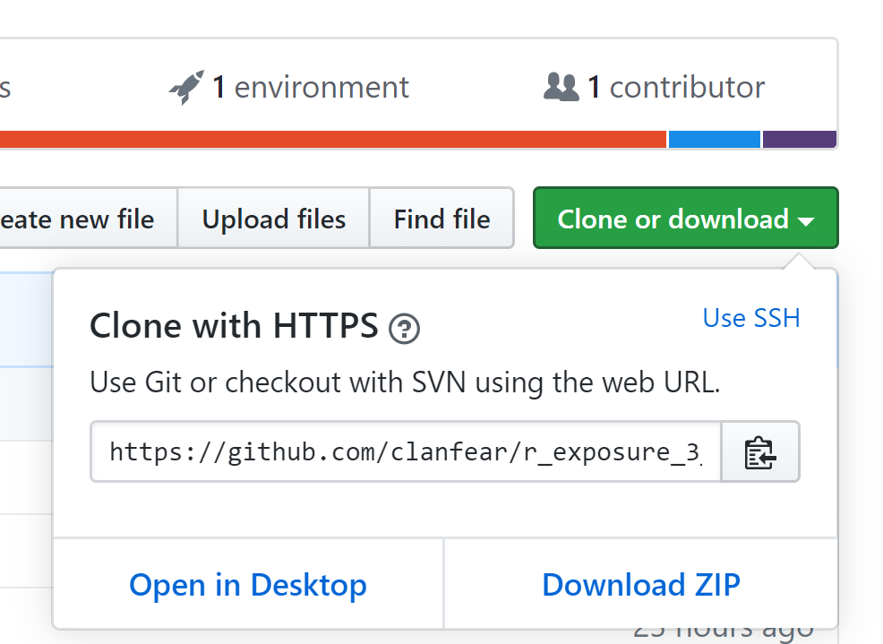

This file contains basic setup for R Exposure 3 & 4.

# Installing Packages

First of all, you will want to run the code in the following chunk to install the packages we will use.

```{r, eval=FALSE, echo=TRUE}
if(!requireNamespace("tidyverse")) install.packages("tidyverse")
if(!requireNamespace("gapminder")) install.packages("gapminder")
if(!requireNamespace("devtools")) install.packages("devtools")
if(!requireNamespace("ggmap")) devtools::install_github("dkahle/ggmap", ref = "tidyup")
```

If you are asked if you want to install packages from source, enter *NO* unless you know you have a compiler installed.

If you are wondering what the above code does, it first checks to see if the package in question is installed, and if not, then installs it. For `ggmap` it must install the most recent version from GitHub which requites the `devtools` package.

# Downloading the Repository

While you can follow along using the `.R` script files linked off the main course page, you'll then have to deal with working directories and making sure data files are in the right spot. This is annoying! An easier solution is to *download the entire workshop* and work directly from the slide .Rmd files. To do this, [go to the GitHub repository for the workshop (link)](https://github.com/clanfear/r_exposure_3_4). Then, click the green button and select [download zip](https://github.com/clanfear/r_exposure_3_4/archive/master.zip).



You can then unzip this into a folder anywhere. You will find each lecture inside the `lectures` folder and appropriate subfolders. Inside, you will want to open the `.Rmd` file (e.g. `r_exposure_3_1_loops.Rmd`). You will then be running code from the actual slides! Note you can run the code in the chunks but will not be able to knit without the additional `xaringan` slide creation package. If you want that, you can install it using `install.packages("xaringan")`. Also, chunks with `eval=FALSE` in their header are not meant to be run and may result in errors--but it won't hurt anything!

